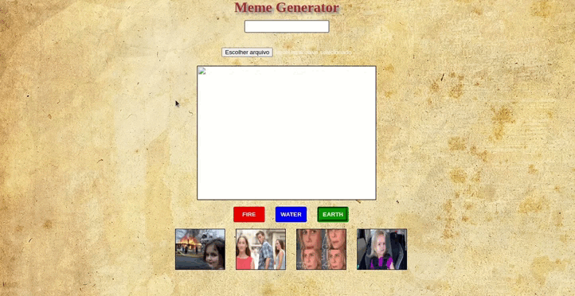
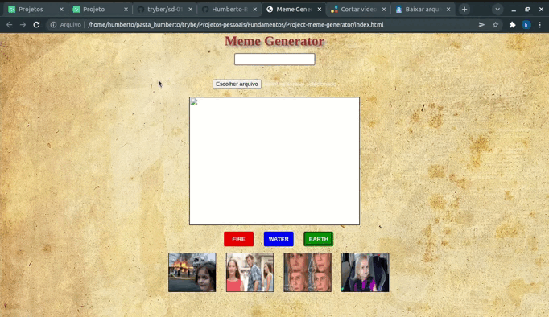

# Boas vindas ao repositório do projeto Meme Generator!

## Descrição do Projeto
Neste projeto desenvolvi uma aplicação onde é possível criar memes com as imagens já disponíveis e também ao realizar o upload de imagens.

---

## Tecnologias utilizadas
Para desenvolver a página foram utilizados **HTML**, **CSS** e **JavaScript**.

---

## Instalação do projeto localmente
Após cada um dos passos, haverá um exemplo do comando a ser digitado para fazer o que está sendo pedido, caso tenha dificuldades, mande mensagem para o meu e-mail _humberto_bonadiman@hotmail.com_.

1. Abra o terminal e crie um diretório no local de sua preferência com o comando **mkdir**:
```javascript
  mkdir projetos-humberto
```

2. Entre no diretório que acabou de criar e depois clone o projeto:
```javascript
  cd projetos-humberto
  git clone git@github.com:Humberto-Bonadiman/Project-meme-generator.git
```

3. Abra o diretório do projeto clonado e dê duplo clique no arquivo index.html e o projeto vai abrir em seu navegador, não é necessário instalar nada mais.

---

## Ilustrações com funcionamento da aplicação





## Requisitos do projeto

### 1 - Crie uma caixa de texto com a qual quem usa pode interagir para inserir texto em cima da imagem escolhida.

- A caixa onde o texto é inserido deve ter um `id` denominado `text-input`;

- Você deve criar um elemento para servir de _"container"_ para a **imagem** e para o **texto** do meme. Este elemento deve ter um `id` denominado `meme-image-container`;

- Dentro do elemento de container, você deve criar um outro elemento para mostrar o texto digitado. O elemento de texto deve estar totalmente contido dentro do container e ter o `id` denominado `meme-text`;

- Se não houver imagem inserida, ele deve ser inserido e estar visível dentro do container vazio onde a imagem aparecerá.

### 2 - O site deve permitir que quem usa faça upload de uma imagem de seu computador.

- Dentro do elemento de container, você deve criar um outro elemento para mostrar a imagem selecionada. Este elemento deve possuir um `id` denominado `meme-image`;

- O elemento onde é feito o upload da imagem deve ser identificado com o `id` denominado `meme-insert`. Este elemento não precisa estar dentro do elemento de container;

- A imagem deve estar totalmente contida dentro do elemento identificado como `meme-image-container` ~~("totalmente contida" quer dizer que não deve sobrar espaço entre o container e a imagem, e a imagem não deve ultrapassar o tamanho do container)~~;

- O texto inserido no elemento `text-input` deve ser inserido sobre a imagem escolhida `meme-image`.

### 3 - Adicione uma moldura no container. A moldura deve ter 1 pixel de largura, deve ser preta e do tipo 'solid'. A área onde a imagem aparecerá deve ter fundo branco.

- O elemento que serve de container para a imagem deve ter o a cor de fundo branca;

- O elemento que serve de container para a imagem deve ter uma borda preta, sólida, com 1 pixel de largura;

- A imagem deve estar totalmente contida dentro do elemento identificado como `meme-image-container` ~~("totalmente contida" quer dizer que não deve sobrar espaço entre o container e a imagem, e a imagem não deve ultrapassar o tamanho do container)~~.

### 4 - Adicione o texto que será inserido sobre a imagem deve ter uma cor, sombra e tamanho específicos.

- O texto do elemento `meme-text` deve ter uma sombra preta, de 5 pixels na horizontal, 5 pixels na vertical e um raio de desfoque de 5 pixels;

- O texto do elemento `meme-text` deve ter a fonte com o tamanho de 30 pixels;

- O texto do elemento `meme-text` deve estar na cor branca.

### 5 - Limite o tamanho do texto que o usuário pode inserir.

-  A quantidade máxima de caracteres digitáveis no elemento `text-input` deve ser 60.

## Requisitos Bônus:

### 6 - Permita a quem usa customizar o meme escolhido acrescentando a ele uma de três bordas. A página deve ter três botões, que ao serem clicados devem cada um trocar a própria borda ao redor do container.

- As bordas devem ser acrescentadas ao container, identificado como `meme-image-container`;

- Os três botões devem ser elementos do tipo `button`;

- Cada elemento `button` deve ser estilizado de forma a ter a cor de fundo da mesma cor que a moldura que irá colocar no container;

- Cada `button` deve ter o respectivo `id` e estilizar o container conforme especificado:

  * Um botão identificado com o `id` chamado `fire` deve estilizar o container da imagem com uma borda de 3 pixels, _dashed_ e vermelha.

  * Um botão com `id` chamado `water` deve estilizar o container da imagem com uma borda azul, com 5 pixels do tipo _double_ .

  * Um botão com `id` chamado `earth` deve estilizar o container da imagem com uma borda do tipo _groove_, verde e com 6 pixels.

- Após uma das três bordas ser selecionada, a borda padrão especificada no requisito 3 não deve mais aparecer;

### 7 - Tenha um conjunto de quatro imagens pré prontas de memes famosos para o usuário escolher. Mostre miniaturas das imagens e, mediante clique do usuário, essa imagem deve aparecer dentro da moldura do elemento de container.

- O elemento que mostra as miniaturas dos memes deve ser identificado um um `id` denominado `meme-1` para o primeiro meme, `meme-2` para o segundo, `meme-3` para o terceiro e `meme-4` para o quarto.

- As imagens que identificam os memes devem ficar dentro da aplicação, num diretório chamado `imgs` com os respectivos nomes `meme1.png`, `meme2.png`, `meme3.png` e `meme4.png`. Atenção também para o formato das imagens! ⚠️

- As imagens devem aparecer dentro do container de forma análoga às imagens enviadas por _upload_ para a página.
